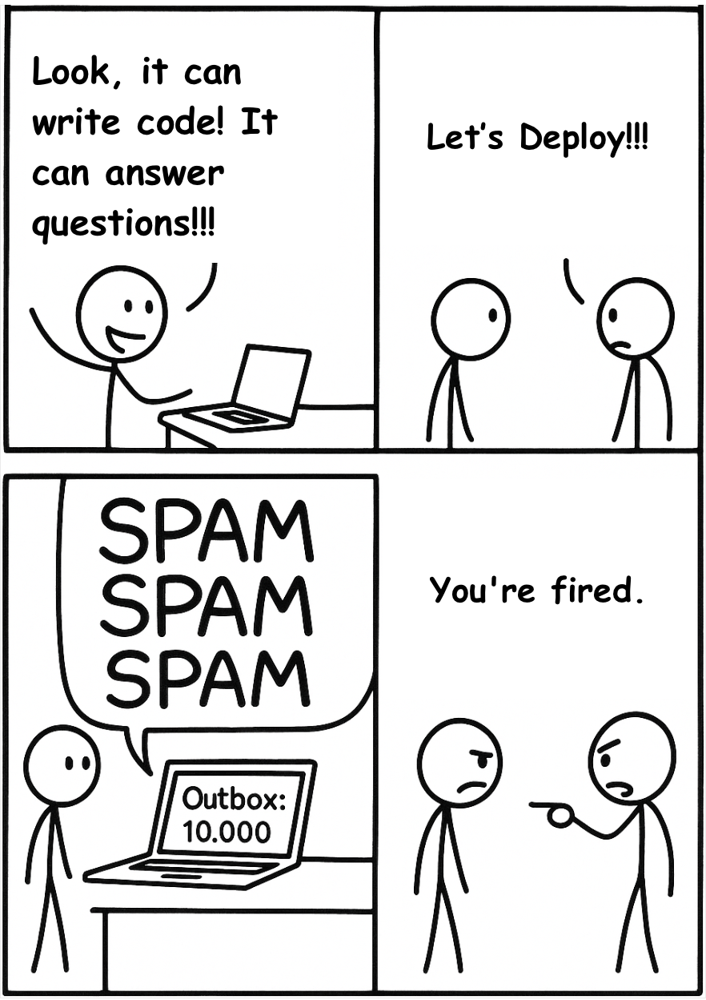

# Don't Build the Agent. Fix the Economics First, Then Write Code

Forget the tech for a second. Let's talk about money.

You're the VP of a big data and analytics team. Someone pitches you an AI agent. Should you deploy it? That's not just a tech question—it's an economics question. 

In this article, I'm diving deep with examples that can help identify the equation that will help us make this decision.

## The Demo vs. Production Reality

**Imagine this:** You did a fast proof-of-concept. In just a couple of days, your agent is writing code, answering questions, analyzing your data, and even sending emails. You're amazed—this thing feels like magic. You rush to show your boss, demonstrate your cool demo, and everyone is impressed.

**"Fantastic. Let's deploy it."**

So you push it to production. Seconds later, chaos. Your agent starts blasting emails—not to a few people, but to 10,000 employees. 

Message after message after message. 

The entire company is being spammed by your brilliant creation. Your boss storms in, furious.



**That's when it hits you:** The proof-of-concept worked—production did not but there is something more to it.

## The Core Problem

**What breaks:** Cool demos ≠ safe production systems. We need actual math to understand this.

Let's represent this scenario as a function that calculates the expected value your agent will bring if deployed versus the cost of operation:

```python
def should_we_deploy_agent(agent):
    # The core equation
    expected_value = (
        agent.probability_success * agent.value_if_right
        - agent.probability_failure * agent.cost_if_wrong
    )
    
    return expected_value > agent.cost_of_operation
```

You're balancing three things here:

1. **Expected impact**
   - Upside if it works: `probability_success × value_if_right`
   - Downside if it fails: `probability_failure × cost_if_wrong`

2. **Run cost**
   - All-in cost to operate the agent safely: `cost_of_operation`

**Decision rule:** deploy only if `(expected upside − expected downside) > cost_of_operation`

Or, equivalently: `expected_value − cost_of_operation > 0`

#### Example 1: Email Response Agent

```python
email_agent = {
    'probability_success': 0.8,      # Works 80% of time
    'value_if_right': 50,            # Saves 1 hour @ $50/hr
    'probability_failure': 0.2,      # Fails 20% of time  
    'cost_if_wrong': 10000,          # Sends wrong email to CEO
    'cost_of_operation': 10          # API costs
}

expected_value = (0.8 * 50) - (0.2 * 10000) = 40 - 2000 = -$1960

# Result: DO NOT DEPLOY (negative expected value!)
```

**Aha!** Now we see the problem. Even though the agent works 80% of the time, the 20% failure rate × high cost of failure = deal breaker.

#### Example 2: Code Review Agent

```python
code_agent = {
    'probability_success': 0.9,
    'value_if_right': 200,          # Saves 4 hours of review time
    'probability_failure': 0.1,
    'cost_if_wrong': 50,            # Bad code gets caught in PR review anyway
    'cost_of_operation': 20
}

expected_value = (0.9 * 200) - (0.1 * 50) = 180 - 5 = $175

# Result: DEPLOY! (positive expected value)
```

**What works:** Now we have a framework for making decisions!

**What breaks:** We still don't know HOW to actually improve these numbers. That's what the three strategies are for.

## The Key Strategies

Making an agent "smarter" doesn't matter. Making the equation positive matters.

There are only three ways to make the equation positive:

1. Make success more valuable
2. Make failure less costly  
3. Make it more reliable

Let's build implementations for each strategy.

### Strategy 1: Maximize Value

**The principle:** Target high-value work and shift from quick answers to substantial tasks.

Let's see this in action:

```python
# Low-value agent
def chat_assistant():
    """Quick chat response - 5 second interaction"""
    response = llm.complete(user_query)
    return response  # Value: $0.50 (saved 2 minutes)

# High-value agent  
def deep_research_agent():
    """Long-running research - hours of work"""
    sources = search_databases(query, depth=10)
    analysis = analyze_sources(sources)
    report = synthesize_report(analysis)
    return report  # Value: $5,000 (saved 2 weeks of analyst time)
```

#### Let's trace through the math:

**Chat Assistant:**
- Value if right: $0.50
- Even with 99% success rate: $0.50 × 0.99 = $0.495
- Hard to justify deployment for 50 cents

**Deep Research Agent:**
- Value if right: $5,000  
- Even with 70% success rate: $5,000 × 0.7 = $3,500
- Much easier to justify!

#### The Market Reality

This is why code agents got funded first. Not because the tech was better—because coding tasks have high economic value.

When you zoom out, the story of AI over the last 18 months can be summarized in one sentence:

**The market rewards impact, not novelty.**

**✅ Coding agents exploded**

Coding agents operate in software engineering, where every completed task is worth serious money. Automating a bug fix, integrating an API, or generating a feature can easily save $500–$5,000 of developer time.

- **Domain:** Software Engineering
- **Typical task value:** $500–$5,000
- **Market size:** Massive—every company writes code
- **Outcome:** 💰 Billions in funding

Coding agents directly replace expensive, high-leverage units of work. They hit a clear ROI from day one.

**⚠️ Chatbots struggled**

Most chatbots live in customer support, where each task is only worth a few dollars. A chatbot resolving a ticket might save $2–$10 of labor—useful, but not transformative.

- **Domain:** Customer Service
- **Typical task value:** $2–$10
- **Market size:** Large, but a commodity
- **Outcome:** 😢 Hard to monetize

Chatbots reduce cost per interaction. Coding agents increase revenue and speed of shipping.

**The Core Insight:** The higher the value of the task the agent automates, the easier it is to build a business around it.

### Strategy 2: Make It Reliable

**The principle:** Blend deterministic workflows with agentic flexibility + make reliability visible.

Let's implement this:

```python
# Version 1: Pure Agent (Unreliable)
def pure_agent_approach(task):
    # LLM decides everything
    plan = llm.decide_what_to_do(task)
    for step in plan:
        action = llm.decide_how_to_execute(step)
        execute(action)
    # Probability of success: 60% (too many decisions, too much uncertainty)

# Version 2: Workflow + Agent (Reliable)
def hybrid_approach(task):
    # DETERMINISTIC: Always do these steps in this order
    workflow = [
        "gather_requirements",
        "analyze_data", 
        "generate_draft",
        "validate_output"
    ]
    
    for step in workflow:
        # AGENTIC: LLM decides HOW to do each step
        result = llm_agent.execute_step(step, context)
        
        # DETERMINISTIC: Always validate before continuing
        if not validate(result):
            return retry_or_fail(step)
    
    # Probability of success: 85% (structure reduces failure modes)
```

#### Let's trace through a real example:

**Task:** "Generate Q4 financial report"

**Pure Agent (unreliable):**
- LLM decides: "I'll grab data from... somewhere?"
  - → 60% chance it uses the right database
- LLM decides: "I'll format it as... maybe Excel?"
  - → 70% chance it uses the right format
- **Overall success:** 0.6 × 0.7 = 42% ❌

**Hybrid Approach (reliable):**
- **Step 1:** [DETERMINISTIC] Connect to financial_db
- **Step 2:** [AGENTIC] LLM writes SQL query for Q4 data
- **Step 3:** [DETERMINISTIC] Validate query returns non-empty results  
- **Step 4:** [AGENTIC] LLM formats data into report
- **Step 5:** [DETERMINISTIC] Check report has all required sections
- **Overall success:** 85% ✅

#### The Observability Piece

But reliability isn't just about actual performance—it's about perceived reliability.

```python
# Without observability
def black_box_agent():
    result = agent.do_something()
    # Stakeholder: "What did it do? Can we trust it?"
    # Probability × 0.5 due to uncertainty penalty

# With observability 
def transparent_agent():
    with trace_all_llm_calls():
        result = agent.do_something()
    # Stakeholder sees: 3 LLM calls, each with reasoning
    # "Oh, it IS being thoughtful!"
    # No uncertainty penalty
```

### Strategy 3: Make Mistakes Cheap

**The principle:** Implement reversibility and Human-in-the-Loop patterns.

This is the most powerful strategy. Let's build it:

```python
# Version 1: Direct Action (Scary!)
def scary_agent(user_request):
    action = llm.decide_action(user_request)
    execute_immediately(action)  # 😱
    # Cost if wrong: $10,000 (action is irreversible)

# Version 2: Reversible Actions (Safe!)
def safe_agent(user_request):
    action = llm.decide_action(user_request)
    
    # Create checkpoint before acting
    checkpoint = save_state()
    
    execute(action)
    
    # User can undo
    if user.is_unhappy():
        revert_to(checkpoint)
    
    # Cost if wrong: $0 (can always undo)
```

#### Example: Git as the Perfect Reversibility System

```python
# Git: The Perfect Reversibility System
class CodeAgent:
    def make_change(self, file, new_code):
        # Every change is a commit
        git.commit(file, new_code)
        # User can always: git revert HEAD
        # Cost if wrong: 0 minutes (instant undo)

# Compare to Email Agent (no native reversibility)
class EmailAgent:
    def send_email(self, recipient, content):
        email_api.send(recipient, content)
        # No undo button
        # Cost if wrong: Your job + company reputation
```

**This is why code agents succeeded:** Not just because code is verifiable—because Git makes mistakes free!

#### Adding Human-in-the-Loop

Human-in-the-loop reduces the ultimate risk:

```python
# Without HITL
def autonomous_agent():
    draft = agent.do_expensive_work()
    publish_immediately(draft)
    # If wrong: disaster already happened
    # Cost if wrong: $50,000

# With HITL  
def hitl_agent():
    draft = agent.do_expensive_work()
    
    # Human approval step
    if human.approves(draft):
        publish(draft)
    else:
        revise_or_discard(draft)
    
    # If wrong: human catches it
    # Cost if wrong: $0 (human stopped it)
```

#### Let's calculate the impact:

```python
# Before HITL
expected_value = (0.7 × 5000) - (0.3 × 50000) = 3500 - 15000 = -$11,500 ❌

# After HITL (human catches 99% of failures)
effective_failure_rate = 0.3 × 0.01 = 0.003
expected_value = (0.7 × 5000) - (0.003 × 50000) = 3500 - 150 = $3,350 ✅
```

**The messy truth:** HITL isn't about making agents "better"—it's about making the cost of failure approach zero, which changes the entire economic equation.

## The Crux: The Real Innovation Isn't Just AI

After building all these systems and running the numbers, here's the core insight:

**The breakthrough isn't making LLMs smarter—it's making the economic equation positive.**

Look at what actually made agents succeed:

- **Git (reversibility)** - existed before LLMs
- **Pull requests (HITL)** - existed before LLMs
- **Workflows (determinism)** - existed before LLMs
- **High-value domains (law, finance, code)** - existed before LLMs

The LLM is just the "agent" part. The reliability comes from everything around it.

Each strategy targets a different variable in the equation:

```python
# The equation again
value = (P(success) × Value) - (P(failure) × Cost) - Operating_Cost

# Strategy 1: Maximize Value
# → Increase 'Value' term by 10-100x (quick answers → substantial work)

# Strategy 2: Increase Probability
# → Increase 'P(success)' from 60% → 85% (workflows + observability)

# Strategy 3: Minimize Cost of Failure
# → Decrease 'Cost' from $50k → $0 (reversibility + HITL)

# Net result: -$11,500 → +$3,350 → Deployment approved!
```

## Bottom Line

If you're building an enterprise agent, don't ask "Is the LLM smart enough?" Ask:

1. **Is the value high enough?** ($5000+ per task, not $5)
2. **Can I make it reliable enough?** (Workflows + observability)
3. **Can I make mistakes cheap enough?** (Reversibility + HITL)

If any answer is "no," don't build the agent. Fix the economics first, then write code.

That's how you go from science experiments to production systems that enterprises actually deploy.